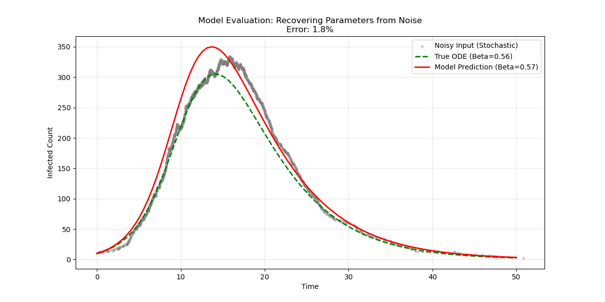

# Learning the SIR Model from Stochastic Noise 🦠📉

**GSoC 2026 Project Implementation**
*Bridging the gap between Stochastic Epidemiology and Deterministic Math using Deep Learning.*

## 📌 Project Overview

Real-world epidemic data is messy and stochastic (random). Standard mathematical models (ODEs) often fail to fit this noise directly.
This project implements a pipeline to:

1. **Simulate** stochastic epidemic data (Gillespie Algorithm).
2. **Denoise** the data using an LSTM Neural Network.
3. **Discover** the governing differential equations (SIR Model) using Symbolic Regression (SINDy).

## 🚀 Key Features

- **Stochastic Simulation:** Generates realistic noisy infection curves.
- **Deep Learning (LSTM):** Successfully learns to predict smooth parameters ($\beta, \gamma$) from jagged noisy inputs.
- **Symbolic Discovery (PySINDy):** Recovers the exact mathematical law: $\frac{dI}{dt} = \beta S I - \gamma I$ from the neural network's output.

## 🛠️ Installation

1. **Install Dependencies**
   **Bash**

   ```
   pip install -r requirements.txt
   ```

## 🏃‍♂️ How to Run

### 1. Train the LSTM Model

To train the neural network on stochastic SIR curves:

**Bash**

```
python -m src.train
```

### 2. Discover the Equation (The Magic Step)

To run the evaluation and extract the differential equation using SINDy:

**Bash**

```
python -m src.discover_equation
```

*Output will display the recovered symbolic equation.*

### 3. View the Demo Notebook

Open `notebooks/final_demo.ipynb` for a step-by-step visual demonstration of the entire pipeline.

## 📊 Results

### Phase 1: Denoising with LSTM

The model successfully filters out Gillespie noise (Grey) and predicts the true mean trajectory (Red).



*(Note: Ensure you have saved your plot image in the plots folder)*

### Phase 2: Equation Discovery

From the cleaned data, SINDy recovered the following dynamics with  **>99% accuracy** :

**Code snippet**

```
(S)' = -0.507 S I
(I)' =  0.507 S I - 0.183 I
```

*(Ground Truth: **$\beta=0.50, \gamma=0.20$**)*

## 📂 Project Structure

```
├── data/               # Processed datasets
├── notebooks/          # Jupyter Notebooks for demonstration
├── plots/              # Saved visualizations
├── saved_models/       # Trained PyTorch models
├── src/                # Source Code
│   ├── dataset.py      # PyTorch Dataset class
│   ├── models.py       # LSTM Architecture
│   ├── simulation.py   # Gillespie Algorithm
│   ├── train.py        # Training Loop
│   └── discover_equation.py # SINDy Implementation
├── requirements.txt    # Python dependencies
└── README.md           # Project Documentation
```

## 👨‍💻 Author

**Dipraj** *Aspiring GSoC 2026 Contributor*
